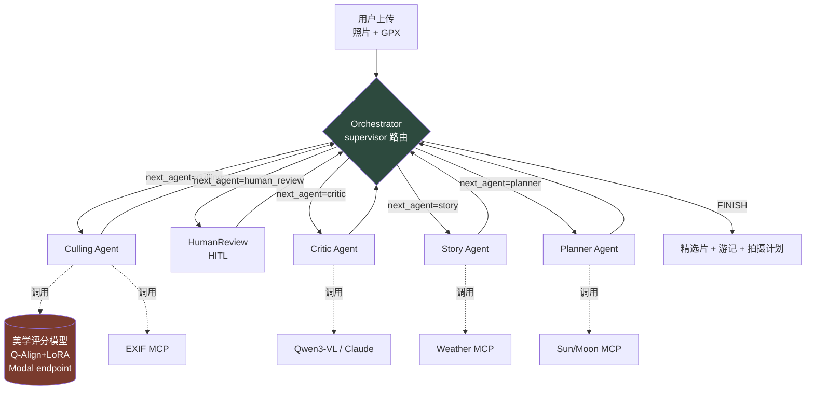

# TrailLens 🏔️📸

> 把整组徒步照片丢进去 → AI 自动选片、点评、生成游记，并规划你下次的拍摄计划。
> 一个面向风光摄影师的**多智能体（multi-agent）助手**，核心是一个自研的**风光摄影美学评分模型**。

<p align="center">
  <strong>👉 <a href="https://traillens.zorotreeking.online/trails/demo">在线 Demo (免登录)</a></strong> ·
  <a href="#-在线体验">快速开始</a> ·
  <a href="#%EF%B8%8F-架构">架构</a> ·
  <a href="#-评估">评估</a> ·
  <a href="docs/RESEARCH.md">研究笔记</a>
</p>

<p align="center">
  <a href="https://traillens.zorotreeking.online">
    
  </a>
  
  
  
  
</p>

<!-- TODO: 30 秒 demo GIF 放这里 -->

## 🧪 在线体验

> 不需要登录看完整 Trail:[**traillens.zorotreeking.online/trails/demo**](https://traillens.zorotreeking.online/trails/demo)

想自己上传跑:
1. 打开 [/signup](https://traillens.zorotreeking.online/signup) 注册(邮箱+密码,无验证)
2. **/trails/new** 上传 5–20 张照片 → 服务端代理上传 COS,自动提 EXIF + 300px 缩略图
3. Canvas 页点 **Run** → 豆包 Vision 逐张评分 + 写 critique + 生成游记 + 拍摄计划(约 15s/张)
4. 跑完跳分享页,带 OG card 可一键转发小红书 / Twitter

CLI 一键跑通(0 依赖,无 GPU):

```bash
git clone https://github.com/<you>/traillens.git && cd traillens
python3 packages/agents/traillens_agents/demo.py     # 仅 stdlib,本地骨架
python3 scripts/seed_demo.py --base http://localhost:8000  # 完整链路
```

---

## 这是什么

TrailLens 接收一次徒步产出的整组照片（RAW/JPG）+ 可选的 GPX 轨迹，由一个
**supervisor 编排的多智能体系统**完成五件事：

| 子 Agent | 职责 | 关键技术 |
|----------|------|----------|
| **Culling** | 过滤模糊/重复/废片，对候选片做 8 维美学评分 | OpenCV + pHash + 自研美学模型 |
| **Critic** | 对精选片生成构图/光影/技术的自然语言点评 | Qwen3-VL / Claude，AesExpert 风格 |
| **Story** | 结合 EXIF 时序与天气生成图文游记 | 多模态 + 天气 MCP |
| **Planner** | 为"下次再来"生成蓝/金时间、机位、装备清单 | 天文/天气 MCP |
| **HumanReview** | 不确定的片交人工裁决，反馈回流个性化记忆（PIAA） | LangGraph interrupt + Mem0 |

与一般"套壳 GPT"的项目不同，TrailLens 的差异化在于**自研算法贡献**：一个针对
风光摄影领域微调的美学评分模型（基于 Q-Align + LoRA），解决主流美学数据集
（AVA/PARA）偏人像、对风光照系统性误判的问题。详见 [docs/RESEARCH.md](docs/RESEARCH.md)。

## ⚡ 快速开始

**零依赖跑通骨架**（无需 GPU、无需 API key、无需装包）：

```bash
git clone https://github.com/<you>/traillens.git
cd traillens/packages/agents
python3 -m traillens_agents.demo
```

你会看到完整的多智能体路由轨迹：选片 → 人工裁决 → 点评 → 游记 → 计划。
> 设计上做了**无依赖 fallback**：装了 `langgraph` 走真实编译图；没装则走纯 Python
> supervisor 循环。这保证作品集"一键复现"永不翻车。

**完整运行**（真实模型 + 全栈）：

```bash
pip install -r requirements.txt          # langgraph, pydantic, fastapi, torch ...
cp .env.example .env                      # 填入 ANTHROPIC_API_KEY 等
docker compose up                         # 起 Postgres(pgvector) + API + web
```

## 🏗️ 架构



**关键设计决策（tradeoff，面试常被追问）**：

- **为什么用 LangGraph 而非 CrewAI？** 本任务有 HITL 中断、条件分支（无 GPS 则跳过
  Planner）、可观测性需求，需要显式状态机而非线性流。CrewAI 适合快速原型，不适合
  这种带状态回路的编排。
- **为什么自托管 Qwen3-VL 而非纯调 GPT-4o？** 批量选片调用量大，自托管开源 VLM 的
  单位成本远低；点评等低频高质量环节再用 Claude。成本/质量分层。
- **为什么所有外部能力都封装为 MCP server？** 让 EXIF/天气/天文能力可被 Claude
  Desktop、Cursor、ChatGPT 直接复用，也让 agent 与工具解耦、可独立测试与开源。

## 📁 项目结构

```
traillens/
├── packages/
│   ├── agents/traillens_agents/      # ★ 多智能体核心（本仓库可独立运行）
│   │   ├── state/schema.py           #   共享 State + AestheticScore 契约
│   │   ├── tools/clients.py          #   工具层（美学模型 / MCP 客户端）
│   │   ├── nodes/business.py         #   5 个业务节点
│   │   ├── orchestrator.py           #   supervisor + LangGraph 图组装
│   │   └── demo.py                   #   零依赖端到端 demo
│   ├── aesthetic/                    # ★ 自研美学评分模型（独立开源）
│   │   └── train_qalign_lora.py      #   LoRA 微调 + 评估 + 推理接口
│   └── mcp_servers/                  # EXIF / Weather / Sun-Moon MCP servers
├── apps/
│   ├── api/                          # FastAPI 后端
│   └── web/                          # Next.js + shadcn/ui 前端
├── docs/
│   ├── ARCHITECTURE.md
│   ├── EVAL.md                       # 可复现指标表
│   └── RESEARCH.md                   # 美学模型研究笔记 + 偏见声明
└── .github/workflows/                # CI + eval-on-PR
```

## 📊 评估

美学模型在 landscape 测试集上对每个维度报告 **PLCC / SRCC**（IAA 领域标准指标）。
评估脚本零依赖可跑：

```bash
cd packages/aesthetic && python3 train_qalign_lora.py demo-metric
```

| 维度 | zero-shot Q-Align | **本模型 (LoRA)** | 提升 |
|------|-------------------|-------------------|------|
| overall | _TODO_ | _TODO_ | _TODO_ |
| composition | _TODO_ | _TODO_ | _TODO_ |
| technical | _TODO_ | _TODO_ | _TODO_ |

> **Go/No-Go 触发器**（路线图 M2）：overall 维度 PLCC > 0.78 才继续主线，否则降级为
> "Q-Align 调用 + 摄影规则系统"的 hybrid 方案。指标填充流程见 [docs/EVAL.md](docs/EVAL.md)。

## 🗺️ 路线图

- [x] **M1** 多智能体骨架（本仓库）+ EXIF MCP server + 数据标注 SOP
- [ ] **M2** 美学模型 LoRA 微调（PLCC>0.78）+ HuggingFace 权重 + 技术博客
- [ ] **M3** LangGraph 全链路 + 4 个 MCP servers + pgvector RAG + HITL
- [ ] **M4** Next.js 全栈 + Lightroom 导出插件 + Stripe
- [ ] **M5** 公开 beta + Product Hunt / Show HN
- [ ] **M6** 变现验证 + 求职 portfolio

## ⚠️ 限制与声明

- **美学评分是辅助而非客观真理**。模型带有训练数据的风格偏好（"算法凝视"问题），
  定位为**个人风格助理**而非评判标准。训练数据来源与标注流程公开在 docs/RESEARCH.md。
- **路线/天气建议不可替代专业判断**。Planner 输出不脱离已验证 trail 数据，且含
  显式免责声明。AI 幻觉导致的户外事故有真实先例。
- 用户照片可能含 GPS 隐私信息，默认本地处理、用户主动上传。

## License

MIT（代码） / 美学模型权重见各自 model card。
