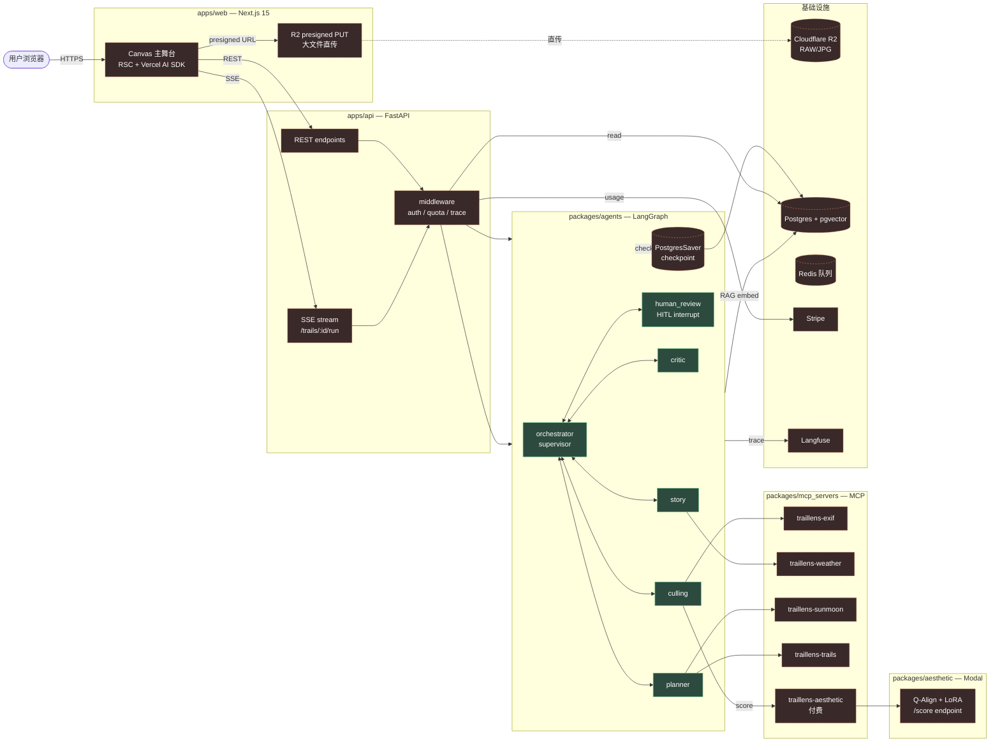
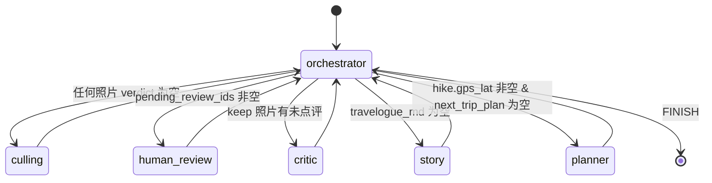
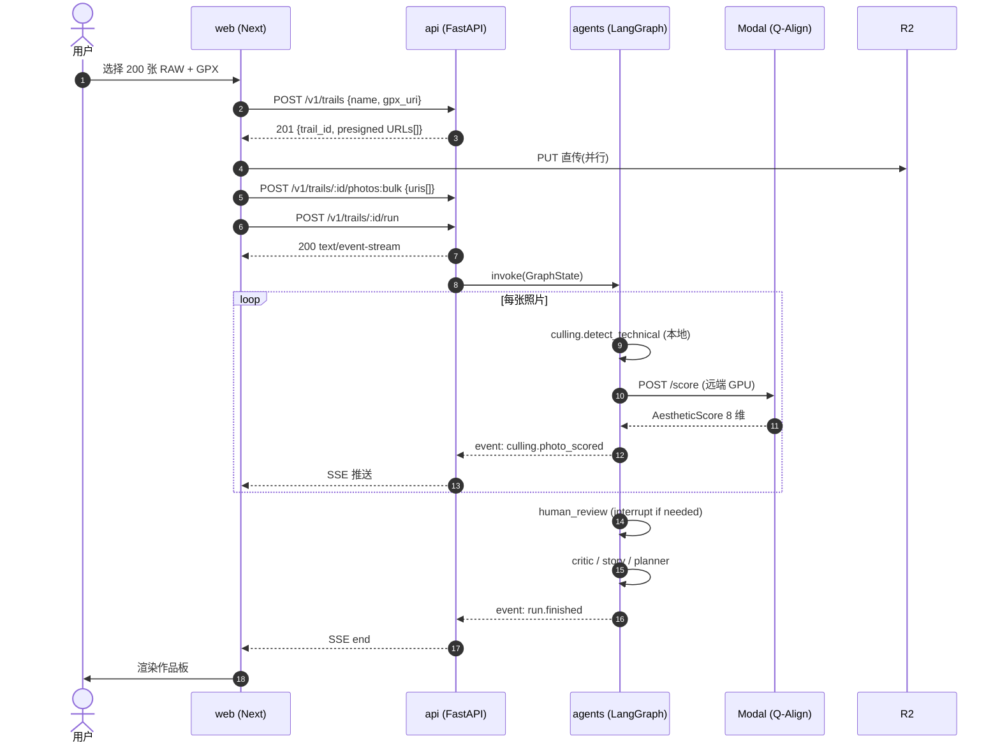

# TrailLens 架构说明

> 本文件是**面向 reviewer 与未来 contributor 的"系统外貌图"**——
> 想了解"为什么这样做"与"路线图"请读 [PRODUCT_PLAN.md](PRODUCT_PLAN.md)；
> 想了解"赛道判断"请读 [../compass_artifact_wf.md](../compass_artifact_wf.md)。

---

## 1. 系统全景



绿色实线 = 已有骨架；红色虚线 = 路线图待落地（参见 PRODUCT_PLAN §6 Sprint 计划）。

---

## 2. Agent 子图（supervisor 路由）



**为什么是 supervisor 而非线性串联**：
- HITL 中断、条件跳过（无 GPS 则跳过 Planner）、可观测性都需要显式状态机。
- 路由可演化为 LLM-as-router（GraphState 加 `route_reason` 字段即可），不改图结构。
- LangGraph 的 conditional_edges + checkpointer 是这类编排的最小依赖；CrewAI 等线性流不适合。

实现入口：
- 路由器：[`orchestrator.decide_next`](../packages/agents/traillens_agents/orchestrator.py)
- 节点：[`nodes/business.py`](../packages/agents/traillens_agents/nodes/business.py)
- 状态契约：[`state/schema.py`](../packages/agents/traillens_agents/state/schema.py)

---

## 3. 模块责任表

| 模块 | 单一职责 | 主要依赖 | 是否可独立运行 |
|---|---|---|---|
| `packages/agents` | 多 agent 编排 + 状态 | langgraph, pydantic | ✅ 零依赖 fallback |
| `packages/aesthetic` | 美学评分模型训练 + 推理服务 | torch, peft, transformers | ✅ demo-metric 子命令 |
| `packages/mcp_servers/*` | 各自一个原子能力 | mcp-sdk + 特定第三方 | ✅ 每个 server 独立发布 |
| `apps/api` | HTTP 接口 + SSE + middleware | fastapi, sqlalchemy, stripe | ❌ 依赖 postgres/redis |
| `apps/web` | UI、上传、Canvas | next, vercel-ai-sdk, shadcn | ❌ 依赖 api |

**契约保护**：跨模块契约由 [`tests/test_consistency.py`](../tests/test_consistency.py) 5 个 contract test 守住——任何一项被破坏，CI 红。

---

## 4. 关键数据流（一次 Trail run）



**关键设计抉择**：
- 大文件**直传 R2**，不走 API（省带宽、绕开 API 文件大小限制）。
- 评分 **stream 回前端**而非一次性返回（§3.1 M1 Stream-First）。
- HITL 用 **LangGraph interrupt + PostgresSaver**，断电也能恢复。

---

## 5. 部署拓扑（目标态）

| 组件 | 平台 | 计费模式 | 备注 |
|---|---|---|---|
| `apps/web` | Vercel | 按 invocation | edge runtime 优先 |
| `apps/api` | Fly.io / Railway | 按容器小时 | 多区域，靠近 R2 |
| `packages/aesthetic` (推理) | Modal | 按 GPU 秒 | 零保留，冷启动可接受 |
| `packages/mcp_servers/*` | npm / pypi 发布 + 可选托管 | — | 用户本地装最常见 |
| Postgres + pgvector | Neon / Supabase | 按存储 + 计算 | 备份每日 |
| Redis | Upstash | 按命令 | 队列 + session |
| Langfuse | 自托管 Docker | — | 数据敏感，避免 SaaS |

---

## 6. 演进与版本策略

- **State schema 是核心契约**，演进遵循"加字段必须默认值、改字段必须迁移"的规则；新增字段必须更新 `tests/test_consistency.py`。
- **LangGraph / langgraph-checkpoint** 每季锁版本（参考 PRODUCT_PLAN §"风险"）。
- **MCP server 协议** 跟随 modelcontextprotocol.io 官方 spec；server `init` 时声明支持的 protocol 版本。

---

## 7. 与其他文档的引用关系

```
README.md              30s 卖点 + Quick Start          [面向陌生人]
├── docs/
│   ├── ARCHITECTURE.md  本文(系统是什么样)              [面向 contributor]
│   ├── PRODUCT_PLAN.md  产品定位 + Sprint 计划         [面向团队/未来的自己]
│   ├── EVAL.md          (TODO) 美学模型指标表           [面向 reviewer / 招聘方]
│   └── RESEARCH.md      (TODO) 美学微调研究笔记         [面向 ML reviewer]
└── compass_artifact_wf.md  赛道调研报告                [战略背景]
```
